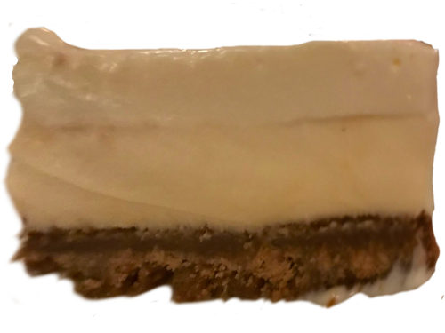

# Justa Pasta's Marvelous Cheesecake

##### Cook time 8 to 16 slices
* approx. 2 hrs cooking
* 4 plus hours cooling and setting

### Cake Lore
For some cheesecake is simply a desert to avoid. There is a reason for that most cheesecake is in the most literal since unpleasant to swallow; the sticky dry and crumbling nature of most cheesecakes has left a bad taste in many peoples mouths. For desert lovers it may seem hopeless; cheesecake that does not crumble and is not dry or sticky with texture that is completely smooth is simply not served everywhere.

Justa Pasta is an excellent Italian restaurant in Portland, OR. This is their recipe for the greatest cheese cake ever made.

### Nutrition (8 servings)
| Calories          | 981   |
|-|-|

|                   | amount| %DV  |
| ----------------- | ----- | ---- |
|Total Fat          | 66.6g | 85%  |
|Saturated Fat      | 39.9g | 199% |
|Cholesterol        | 201mg | 67%  |
|Sodium             | 736mg | 32%  |
|Total Carbohydrate | 87.8g | 32%  |
|Total Sugars       | 62.7g |      |
|Protein            | 13.2g |      |

---
### Ingredients

##### Crumb Crust
* 3 cups graham cracker crumbs; approx. 3 sleeves
* 1/2 cup firmly packed light brown sugar
* 1/2 cup unsalted butter, softened

##### Filling
* 32 oz (4 pkgs) cream cheese at room temperature
* 1 cup sugar, preferably baker's
* 1 tsp vanilla extract
* 1/2 tsp almond extract, preferably alcohol-free
* 1 egg at room temperature

##### Topping
* 2 cups sour cream
* 3/4 cup sugar
* Juice of 1 medium lemon
* 1/2 tsp vanilla extract
* 1 drop of almond extract

##### Tools
* Measuring cups
* Measuring spoons
* 10 inch spring-form pan
* Food processor
* Spatula
* Refrigerator
* Oven
* Oven mittens
---

### Directions

Follow the directions in the order listed below.

##### Pre-Prep
* Leave out the butter, cream cheese, and egg out to reach room temperature, **Do not microwave to speed up the process**.
* Juice the lemon now or later when you will have 40 min to do so.

##### Crumb Crust
1. crush gram crackers into crumbs until all particulates are smaller than your pinky nail; smaller crumbs will lead to a harder crust but less soggy crust

2. In a large bowl: Mix together the graham cracker crumbs, brown sugar and butter until well blended and crumbly.

3. Transfer to a 10-inch spring-form pan and firmly press the mixture onto the bottom of the pan.

4. Chill the crust while making the filling.

*Note: To mix the crumbs it is be best to use your hands to squeeze the butter, brown sugar, and graham cracker together.*

##### Filling
1. In a food processor, combine the cream cheese, sugar, vanilla and almond extract until creamy and smooth, scraping down the sides and bottom of the bowl as necessary.

2. Beat in the egg until fully blended.

3. Pour into the spring-form pan tap the

4. Place it in the center of the oven.

5. Turn on the oven to 350 degrees and bake for 40 minutes. Do not use convection setting if you have it; The cake will start from a cold oven.

*Note: The cake may leek so it is recommend that a pan is used to catch drippings to avoid cleaning the oven later.*

*Note: Over processing the cream cheese will result in small bubbles which will change how good the cake looks. This is as the cake will expand and contract more with temperature, cracking the smooth topping layer.*

##### Topping

1. Meanwhile, mix together the sour cream, sugar, lemon juice, vanilla and almond extract until blended.

4. Remove the cheesecake from the oven and gently spread the topping over the cake.

5. Lower the oven to 300 degrees (after removing) and bake for 15 additional minutes (after topping is applied).

6. Transfer to the refrigerator to chill at least 4 hours or overnight.

7. Using a paring knife, loosen the sides from the inside edge of the pan. Slice and serve.

8. Serve and enjoy.

*Note: from the original author: "Carfargo does not cool her cheesecake before chilling it"*